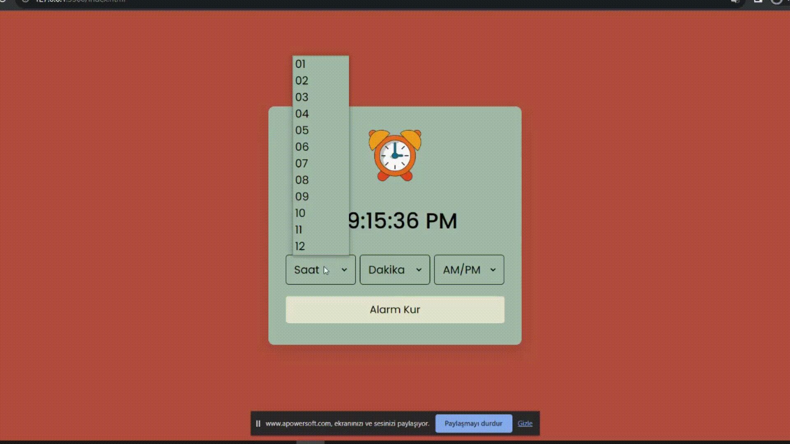

<h1>Alarm Clock</h1>

I worked on a simple alarm clock project using HTML, CSS and JavaScript.
 This project aimed to create a user-settable alarm clock on a web page.

<h2>Technologies Used</h2>
<h3>The website was developed using the following technologies:</h3>

HTML
CSS
Javascript

